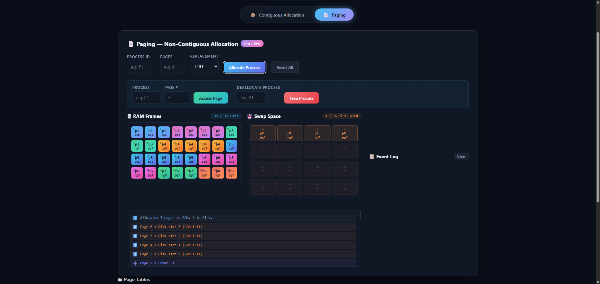

# 🧠 Memory Allocation Visualizer

> An interactive, browser-based simulator for two fundamental OS memory management techniques — **Contiguous Allocation** and **Paging**.  
> Built as a project for **CSE323: Operating Systems** at North South University.

---

## ✨ Overview

Standard memory management tools show static diagrams and stop. This project goes further — it **simulates, animates, and makes tangible** how an OS actually allocates, pages, and replaces memory in real time.

---

## 📖 What It Demonstrates

### Contiguous Allocation
- How an OS places a process into a single unbroken block of physical memory
- Three classical placement algorithms — **First Fit**, **Best Fit**, and **Worst Fit** — and how they differ in where they place a process
- **External fragmentation** — how repeated allocation and deallocation leaves unusable holes scattered across memory, eventually causing allocation to fail even when total free memory is sufficient

### Paging
- How an OS eliminates external fragmentation by breaking memory into fixed-size **frames** and mapping process **pages** to any available frame, regardless of physical location
- **Address translation** — how a logical address (process + page number) maps to a physical frame via a page table
- **Page faults** — what happens when a requested page is not in RAM and must be fetched from disk (swap space)
- **Page replacement** — how the OS decides which frame to evict when RAM is full, using **LRU** or **FIFO**
- **Swap space** — how disk acts as overflow storage for pages that don't fit in RAM
- **Thrashing detection** — identifying when fault rate is so high the system is doing more swapping than useful work

---

## 🎬 Demo

[](https://www.youtube.com/watch?v=JIXnIfQkcWA)

*Click the image above to watch the full demo on YouTube.*

---

## 🛠 Tech Stack

| Layer | Technology |
|---|---|
| UI & Structure | HTML5, CSS3 |
| Logic & Interactivity | Vanilla JavaScript (ES Modules) |
| Module system | Native browser `import`/`export` — no bundler required |
| Runtime | Any static file server (VS Code Live Server, etc.) |

No frameworks. No build step. No dependencies.

---

## 📁 Project Structure

```
OS_project/
├── index.html                  # Entry point — tab layout, all UI markup
├── assets/
│   └── style.css               # Full styling — dark theme, grid, animations
└── src/
    ├── main.js                 # Wires UI events to MemoryManager and PagingEngine
    ├── MemoryManager.js        # Contiguous allocation state and logic
    ├── PagingEngine.js         # Paging engine — frames, page tables, swap, stats
    ├── algorithms/
    │   ├── firstFit.js         # First Fit placement
    │   ├── bestFit.js          # Best Fit placement
    │   └── worstFit.js         # Worst Fit placement
    └── components/
        ├── Controls.js         # Form input helpers
        └── MemoryBlock.js      # Renders a single contiguous memory block
```

---

## ⚙️ Core Algorithms

### First Fit
Scans the free block list from the beginning and allocates the **first block large enough** to fit the request. Fast but tends to leave small fragments near the front of memory over time.

### Best Fit
Searches **all free blocks** and picks the **smallest one that still fits**. Minimizes wasted space per allocation but can produce many tiny unusable fragments.

### Worst Fit
Picks the **largest available free block**. The rationale is that the leftover fragment after allocation is also large, keeping it useful for future requests. Performs poorly in practice for most workloads.

### LRU (Least Recently Used) Page Replacement
When RAM is full and a page fault occurs, the frame whose page was **accessed furthest in the past** is evicted. Approximates optimal replacement and performs well for most real workloads.

### FIFO (First In, First Out) Page Replacement
Evicts the frame that was **loaded into RAM earliest**, regardless of how recently it was accessed. Simple to implement but can evict heavily-used pages, performing worse than LRU in most cases.

### Thrashing Detection
A sliding window of the last 20 memory accesses is maintained. If more than 70% of accesses in that window are page faults, the system is flagged as thrashing — a state where more time is spent swapping than executing.

---

## 🚀 How to Run

1. Clone or download the project folder
2. Open it in **VS Code**
3. Right-click `index.html` → **Open with Live Server**

That's it. No install, no build, no terminal.

---
